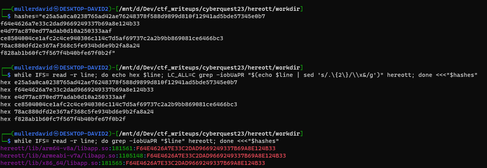

# Setting up the environment

Android device or emulator with or without root access was used. 

See [Android environment](../../_knowledgebase/android/environment.md) for more details.


# Installing the application

Installing with ADB.

```bash
adb install hereott.apk
```

Opening the application reveals a login screen.


Basic attempts can't log us in.

# Adding proxy

The burp proxy was enabled.

```bash
adb shell settings put global http_proxy 10.0.1.2:8080
adb shell settings put global http_proxy :0 # to turn off
```

Opening the application detects the tampering.


# Bypassing certificate pinning

We have at least the 2 following choices.

## Frida

Use the [Frida](https://frida.re/) platform to dynamically patch the pinning. This requires rooted device.

Start frida server on the device.

```bash
adb shell su -c /data/local/tmp/frida-server
```

The following script was used for unpinning: [frida-unpinning.js](https://codeshare.frida.re/@workwhileweb/ssl/). Starting the application with our hook now.

```bash
frida -U -l frida-unpinning.js -f hu.honeylab.cyberquest.hereott
```

Starting the app now is going through our proxy.


## Using own certificate

Patch the pinned certificate, this requires NO rooted device.

The website cert can be checked. The domain and port can be acquired from a packet dump for example.

```bash
openssl s_client -showcerts -connect hereott.honeylab.hu:48490 </dev/null
```

Upon inspection of the APK file, there is `hereott.apk/assets/cert.pem` inside with the same key. The application is pinning the tls cert to this one. 

This can be replaced and the apk resigned. The `cert.der` is the burp proxy cert exported.


```bash
cp hereott.apk hereott_mod.apk
mkdir -p assets
openssl x509 -in cert.der -outform pem -out assets/cert.pem
zip hereott_mod.apk assets/cert.pem
zip -d hereott_mod.apk 'META-INF/*.SF' 'META-INF/*.RSA' 'META-INF/MANIFEST.MF'
keytool -genkey -v -keystore resign.keystore -alias resign -keyalg RSA -keysize 2048 -validity 10000 -storepass resign -dname "CN=resign"
rm hereott_mod_align.apk
zipalign -v 4 hereott_mod.apk hereott_mod_align.apk
apksigner sign --ks resign.keystore --ks-pass pass:resign hereott_mod_align.apk
```

Reinstall using the new apk, as the signing key was changed.

```bash
adb uninstall hu.honeylab.cyberquest.hereott
adb install hereott_mod_align.apk
```

Now the application is detecting the modification. The app is doing the same if we don't modify anything just resign it.


A common technique is to check the signer certificate hash. Viewing the original reveals a bunch of hash.

```bash
apksigner verify --print-certs -v hereott.apk
```

```
Signer #1 certificate DN: CN=HereOTTT, OU=CyberQuest 2023, O=honeylab.hu, L=Meseorszag, ST=MO, C=MO
Signer #1 certificate SHA-256 digest: e25a5a0ca0238765ad42ae76248378f588d9899d810f12941ad5bde57345e0b7
Signer #1 certificate SHA-1 digest: f64e4626a7e33c2dad9669249337b69a8e124b33
Signer #1 certificate MD5 digest: e4d77ac870ed77adab0d10a250333aaf
Signer #1 key algorithm: RSA
Signer #1 key size (bits): 2048
Signer #1 public key SHA-256 digest: ce8504004ce1afc2c4ce940306c114c7d5af69737c2a2b9bb869081ce6466bc3
Signer #1 public key SHA-1 digest: 78ac880dfd2e367af368c5fe934bd6e9b2fa8a24
Signer #1 public key MD5 digest: f828ab1b60fc7f567f4b40bfe67f0b2f
```

The apk can be unpacked.

```bash
mkdir -p hereott
unzip hereott.apk -d hereott
```

And searched for these hashes, for example in both binary and string representation.

```bash
hashes="e25a5a0ca0238765ad42ae76248378f588d9899d810f12941ad5bde57345e0b7
f64e4626a7e33c2dad9669249337b69a8e124b33
e4d77ac870ed77adab0d10a250333aaf
ce8504004ce1afc2c4ce940306c114c7d5af69737c2a2b9bb869081ce6466bc3
78ac880dfd2e367af368c5fe934bd6e9b2fa8a24
f828ab1b60fc7f567f4b40bfe67f0b2f"
while IFS= read -r line; do echo hex $line; LC_ALL=C grep -iobUaPR "$(echo $line | sed 's/.\{2\}/\\x&/g')" hereott; done <<<"$hashes"
while IFS= read -r line; do grep -iobUaPR "$line" hereott; done <<<"$hashes"
```

There are a few matches, uppercase `F64E4626A7E33C2DAD9669249337B69A8E124B33`.



Our resigner cert has the following hash with the same type. 

```bash
apksigner verify --print-certs -v hereott_mod_aligned.apk
```

```
Signer #1 certificate SHA-1 digest: f72905858fcb01a95d6abeaa4cf113df4e099691
```

Replacing `F64E4626A7E33C2DAD9669249337B69A8E124B33` with the uppercase version `F72905858FCB01A95D6ABEAA4CF113DF4E099691`. Resigning the apk again.

```bash
mkdir -p lib/arm64-v8a
mkdir -p lib/armeabi-v7a
mkdir -p lib/x86_64
bbe -e 's/F64E4626A7E33C2DAD9669249337B69A8E124B33/F72905858FCB01A95D6ABEAA4CF113DF4E099691/' hereott/lib/arm64-v8a/libapp.so > lib/arm64-v8a/libapp.so
bbe -e 's/F64E4626A7E33C2DAD9669249337B69A8E124B33/F72905858FCB01A95D6ABEAA4CF113DF4E099691/' hereott/lib/armeabi-v7a/libapp.so > lib/armeabi-v7a/libapp.so
bbe -e 's/F64E4626A7E33C2DAD9669249337B69A8E124B33/F72905858FCB01A95D6ABEAA4CF113DF4E099691/' hereott/lib/x86_64/libapp.so > lib/x86_64/libapp.so
zip -r hereott_mod.apk lib
rm hereott_mod_align.apk
zipalign -v 4 hereott_mod.apk hereott_mod_align.apk
apksigner sign --ks resign.keystore --ks-pass pass:resign hereott_mod_align.apk
```

Updating the app.

```bash
adb install hereott_mod_align.apk
```

Is finally bypassing the protection.

# Getting the url


https://blog.tst.sh/reverse-engineering-flutter-apps-part-1/