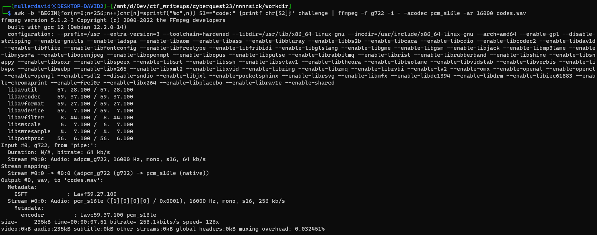

# Analyzing the file

The file is a compressed text file with some printed values of variable assignment in the format `name: value`.

```bash
unxz -c challenge.xz > challenge
head -n 1000 challenge > challenge_head1000
head -n 10 challenge
awk '{print $1}' challenge | sort -u | tee challenge_vars
```


# Getting the source

Based on the unique variables, the file can be found via [github search](https://github.com/search?q=%22code%22+%22dlowt%22+%22ihigh%22+%22outlen%22+%22rlow%22+%22wd1%22+%22wd2%22+%22wd3%22+&type=code) with parameters: `"code" "dlowt" "ihigh" "outlen" "rlow" "wd1" "wd2" "wd3"`.

One such file, assuming the original was written in C, is the G722 codec decoder, for example,  [g722_decode.c](https://github.com/asterisk/asterisk/blob/master/codecs/g722/g722_decode.c) in the asterisk project.

The assignments can be matched manually for the first few lines, like this.


Looks like the data is unpacked with default 8 bits per sample.

# Converting to audio

FFMpeg supports the G722 codec, therefore the input can be used as is. The `code` variable is used in the source to read the input in a for loop, therefore it can be used to extract the original G722 encoded array as the input.

```bash
awk -b 'BEGIN{for(n=0;n<256;n++)chr[n]=sprintf("%c",n)} $1=="code:" {printf chr[$2]}' challenge | ffmpeg -f g722 -i - -acodec pcm_s16le -ar 16000 codes.wav
```



The audio file ([codes.wav](workdir/codes.wav)) is the flag itself, saying it out loud.

# Flag

`CQ23{G722ROCKS4115}`