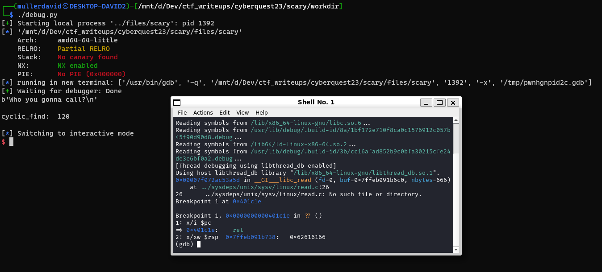
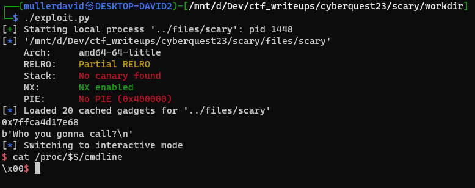

# Getting the challenge

The file is an executable.

Upon running the binary, it has a small question.


# Checking the logic

Ghidra can recover the code ([scary.c](workdir/scary.c)) relatively well. 

```c
undefined8 FUN_00401b70(void)
{
  int iVar1;
  char *local_80;
  char local_78 [112];
  
  FUN_00401249();
  FUN_004011b6();
  printf("Who you gonna call?\n",local_78);
  read(0,local_78,0x29a);
  local_80 = (char *)FUN_00401a62();
  iVar1 = strcmp(local_78,local_80);
  if (iVar1 == 0) {
    printf("Peter is calling the Ghostbusters... Their number is: %llx\n",&local_80);
    FUN_00401b5f();
  }
  FUN_00401b04(local_78);
  return 0;
}

void FUN_00401b04(char *param_1)
{
  size_t sVar1;
  int local_1c;
  
  local_1c = 0;
  while( true ) {
    sVar1 = strlen(param_1);
    if (sVar1 <= (ulong)(long)local_1c) break;
    param_1[local_1c] = param_1[local_1c] ^ 0x2a;
    local_1c = local_1c + 1;
  }
  return;
}

```

FUN_00401b70 looks like the main function with the question. Before returning, it is xoring the input with FUN_00401b04 up until a null byte (strlen).

# The problem(s)

## Overflow

The program is reading 0x29a bytes into a 0x70 buffer.

## Leak

After entering the question, it is comparing it with something and if it is matching, printing the decrypted string address and restarting the question. 

The FUN_00401a62 decrypts that something from `S3hxd4RhJHK2d4SmVopL`. We can just stop on the `strcmp` call and read the decrypted string.


It is `Gh0st  busteRz`. Now it is printing the address.


We can also use the this to store arbitrary data at fixed offset from the leak, as strcmp compares up until the null byte, keeping our extra data intact.

# Exploit

Pwntools can be used to view protections. There is no stack canary or PIE, or practically anything, but NX is enabled. Can also be used to generate some cyclic strings to determine the RIP offset. The program can be stopped on returning from the FUN_00401b70 to get the offset. See [debug.py](workdir/debug.py).



As NX is enabled, we need to build a ropchain.

# ROP

Ropper or pwntools can be used to generate gadgets. See [ropper.txt](workdir/ropper.txt).

```bash
ropper --nocolor --file ../files/scary > ropper.txt
```

The `syscall` is available as gadget, and we can store arbitrary data at known address. This might allows using the `execve` syscall.

<https://filippo.io/linux-syscall-table/>


Also need gadgets to write values to RAX, RDI, RSI, RDX. Fortunatelly all are available as simple pop gadgets. 

```
0x0000000000401481: pop rax; ret;
0x0000000000401483: pop rdi; ret;
0x0000000000401485: pop rsi; ret;
0x0000000000401489: pop rdx; ret;
0x000000000040147f: syscall;
```

The payload is xored at the end of function, but only until the first null byte. We can insert that null byte manually to prevent our important parts edited.

Running the ropchain results in a shell. See [exploit.py](workdir/exploit.py).



TODO: replace screenshot from live environment

# Flag

TODO: add flag from live env