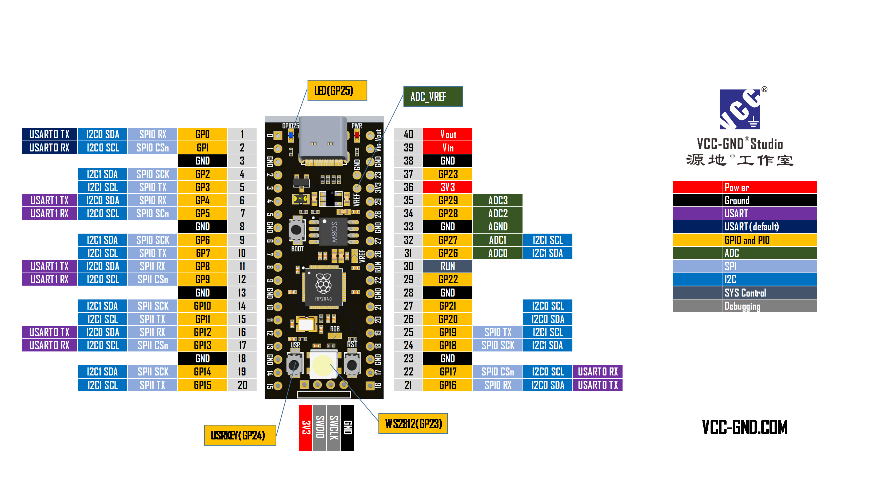

# ECSC preparatoion HW

These are some hardware challeges that were created for ECSC preparation.

While using the `SWD` debug interface would make things easier, it shouldn't be used.

# Hardware
Simple RP2040 Raspberry Pico variant was targeted, the `YD-RP2040`.

# Useful docs for RP2040
<https://developer.arm.com/documentation/dui0473/m/overview-of-the-arm-architecture>

<https://developer.arm.com/Processors/Cortex-M0-Plus>

<https://github.com/raspberrypi/pico-sdk>

<https://github.com/raspberrypi/picotool>

<https://datasheets.raspberrypi.com/pico/getting-started-with-pico.pdf>

# COM port

The challenges start instantly, so a client that reconnects the COM port instantly is recommended. 

The connection is using the usual settings with `115200` baud rate.

VS Code has [Serial Monitor](https://marketplace.visualstudio.com/items?itemName=ms-vscode.vscode-serial-monitor) plugin that can reconnect. Pay attention to enable the automatic reconnection, the newline and send as options.

# Extras

## Flash Nuke

The [flash_nuke.uf2](extras/flash_nuke.uf2) is just the regular flash nuke firmware to clear everything.

## Ducky

  
Spoiler
 
  
The [ducky.uf2](extras/ducky.uf2) is a rubber ducky implemented in circuitpython. Pressing the `USR` key disables running the payload and enters regular mass storage mode for editing. The current payload is just a small curl.

It was made based on this guide: <https://github.com/dbisu/pico-ducky> . 

