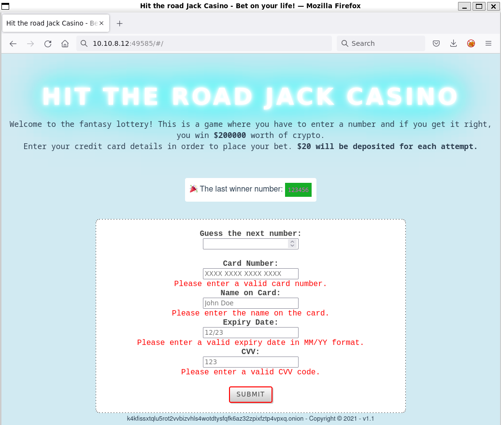

# Scan

Scanning the host reveals port `49585`.

# Checking the site

Visiting in a browser reveals a casino.

It generates a new random 6 digit number every 5 seconds. Guessing the next is supposed to win a prize.

The onion address is not valid.

# Logic

Checking the source code, the form is sending the guess to `http:/10.10.8.12:53530/post/send_number` as JSON. The past random numbers are coming from websocket `ws://10.10.8.12:53530/ws/numbers`.

Filling the form with valid data returns a Stripe API error.

Stripe API is a credit card handling API. There are test cards in the official documentation: <https://stripe.com/docs/testing>.

Using a test card data works, but the guessed number is not the next.

Based on the challenge description and hint, it has something with the types.

Fuzzing with various number formats and various types like `{}`, `[]`, `NaN`, returns nothing useful.

Giving type instead of value is accepted on the other hand. Sending `number` reveals the flag. Other numeric types like `float`, `int`, etc also works.

# Flag
HCSC{r34l_p1r4t3s_4r3_4lw4y5_3qu4l}